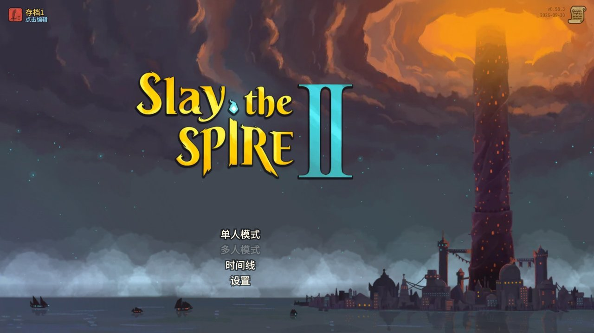
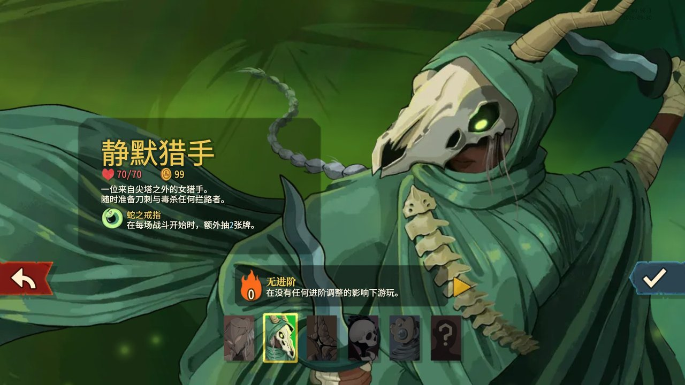
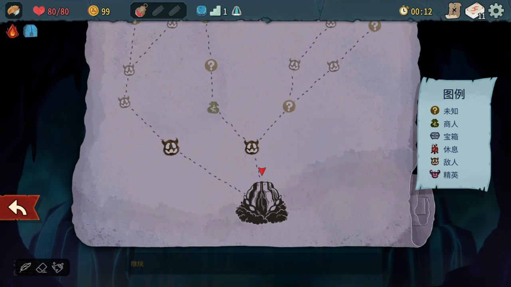
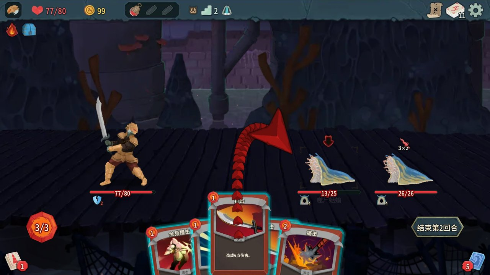
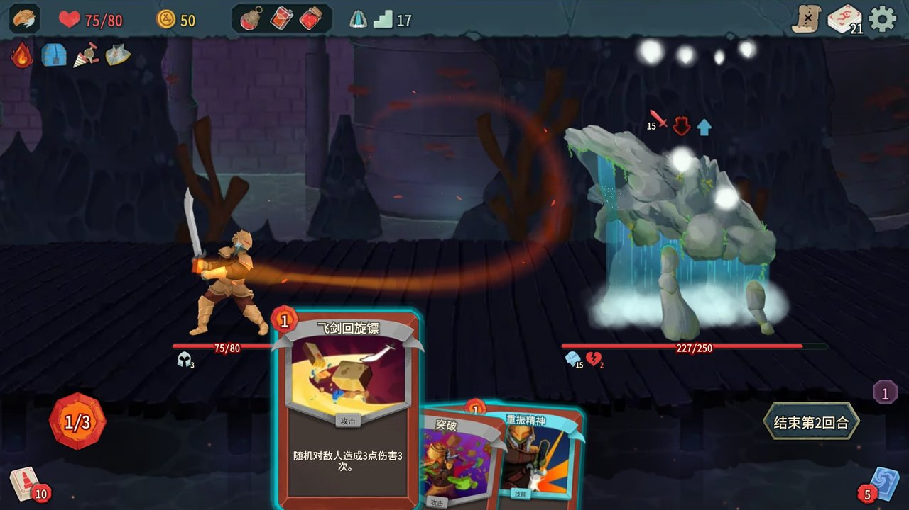
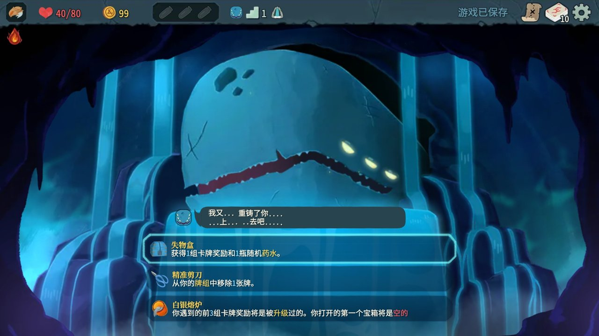
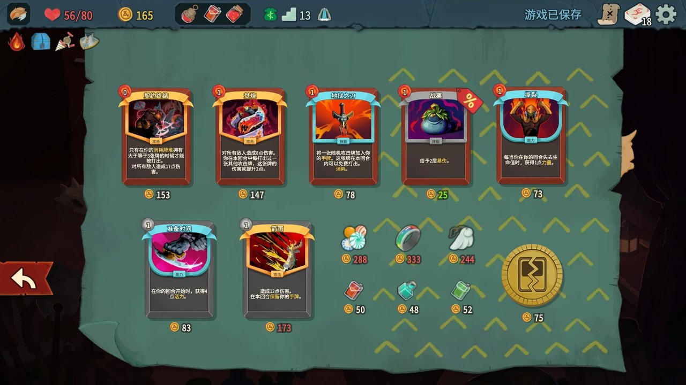
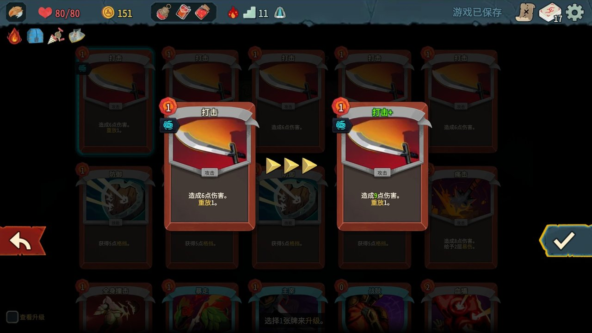
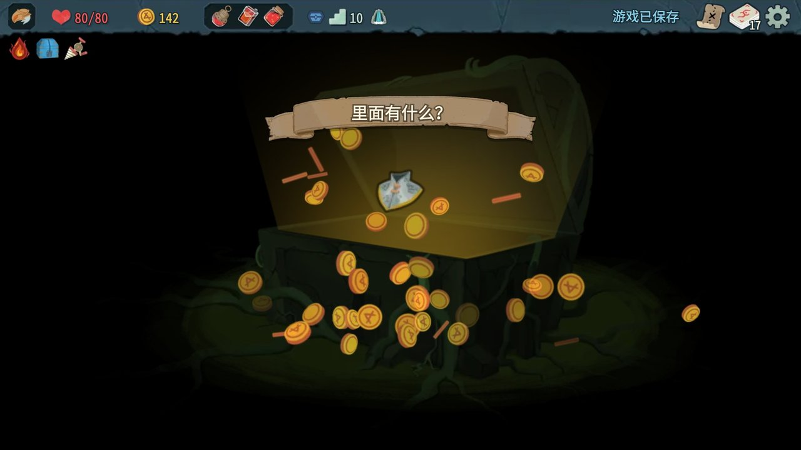

<div align="center">

# sts2-web

**在浏览器里运行的《Slay the Spire 2》**

把原作（v0.98.3）的规则代码机械转译成 TypeScript，再用 Preact + Pixi 重建表现层。
没有后端，纯静态页面，打开就能玩。

[截图](#截图) · [特性](#特性) · [快速开始](#快速开始) · [工作原理](#工作原理) · [设计文档](docs/sts2-web-port-plan.md)



</div>

> [!IMPORTANT]
> 这是一个非官方的学习项目，仅供学习使用，与 Mega Crit 无关。
> 《Slay the Spire 2》及其美术、音频、文本的版权归 Mega Crit 所有。喜欢这个游戏请[购买正版](https://store.steampowered.com/app/2868840/Slay_the_Spire_2/)。

## 截图

| | |
|:---:|:---:|
| <br>角色选择 | <br>地图 |
| <br>战斗 | <br>Boss 战 |
| <br>事件 | <br>商店 |
| <br>休息处升级卡牌 | <br>宝箱 |

## 特性

- **规则与原作一致**：规则层不是手工重写，而是由反编译的 C# 经 Roslyn 转译器整体生成（约 14.6 万行 TypeScript），卡牌、遗物、能力、怪物、事件的结算逻辑都来自原作代码。
- **完整的单人流程**：五个角色、地图、战斗、事件、商店、休息处、宝箱、Boss，以及每日挑战和自定义模式。
- **菜单侧界面**：图鉴（卡牌库、遗物、药水）、时间线、统计、历史记录、存档档位、设置。
- **原作的表现**：Spine 骨骼动画、Godot 场景与粒子、着色器、战斗特效都在 Web 上重建；FMOD 音频转成 Opus 后由自己的事件引擎播放。
- **14 种语言**：沿用原作的本地化文本，`?lang=zhs` 切换。
- **本地存档**：存档保存在浏览器的 IndexedDB，支持保存并退出后继续。
- **可离线**：Service Worker 缓存访问过的资源，可作为 PWA 安装。

暂不支持：多人联机、Mod、Steam 集成、手柄。

## 快速开始

需要 Node 20+ 和 pnpm。运行所需的游戏资源和生成代码已经在仓库里，不需要安装游戏。

```bash
git clone https://github.com/moonrailgun/sts2-web.git
cd sts2-web
pnpm install
pnpm dev        # http://127.0.0.1:47173/
```

构建静态产物：

```bash
pnpm build                       # 产物在 packages/app/dist
pnpm -F @sts2/app preview        # http://127.0.0.1:47174/
```

### 页面参数

| 参数 | 作用 |
|---|---|
| `?seed=<种子>` | 指定本局种子 |
| `?lang=zhs` | 指定语言 |
| `?unlock=all` | 全部解锁（等同原版控制台的 unlock all：全部发现、纪元揭示、进阶 10） |
| `?tutorials=off` | 关闭新手提示 |
| `?scene=<场景路径>` | 仅开发服务器：全屏显示单个场景，如 `scenes/rest_site/hive_rest_site.tscn` |

## 工作原理

```
游戏安装包
  ├─ tools/extract.py、audio.py、scenes.py …  ──▶  assets/                  美术、动画、音频、文本、场景
  └─ tools/decompile.sh  ──▶  ref/decompiled
                                 └─ tools/cs2ts（Roslyn） ──▶  packages/core/src/gen   转译出的规则层

packages/core   运行时：C#/.NET 语义（BCL、集合、LINQ、Task、JSON）与 Godot API 的 TypeScript 实现
packages/app    表现层：Preact UI + Pixi 渲染，通过 bridge 接上规则层调用的场景节点
```

| 目录 | 内容 |
|---|---|
| `packages/core` | 转译出的规则层（`src/gen`）和让它跑起来的运行时（`src/rt`），附无头测试 |
| `packages/app` | 浏览器应用：UI、渲染、特效、音频、存档 |
| `tools/cs2ts` | C# → TypeScript 转译器 |
| `tools/*.py` | 资源提取：Godot 资源包、FMOD 音频、Spine 索引、场景与着色器转换 |
| `tools/e2e` | Playwright 脚本：自动游玩、覆盖测试、性能测量、截图 |
| `tools/video` | 介绍视频的逐帧录制与合成 |
| `assets` | 提取并压缩后的游戏资源 |
| `docs` | [移植方案与实施记录](docs/sts2-web-port-plan.md) |

## 测试

```bash
pnpm -F @sts2/core test     # 无头测试（约 2 分钟）
```

浏览器端测试用 Playwright 驱动真实界面，先安装浏览器：`npx playwright install chromium-headless-shell`。

```bash
CHROME=<headless shell 路径> FAST=1 GOD=1 node tools/e2e/play.mjs /tmp/play       # 自动游玩
CHROME=<路径> UNLOCK=0 GOD=1 FULL=1 SEED=E2EFINAL node tools/e2e/play.mjs /tmp/full 12000   # 全新存档完整一局
CHROME=<headless shell 路径> node tools/e2e/coverage.mjs /tmp/cov                 # 全部卡牌/药水/遭遇战/遗物/事件覆盖
CHROME=<headless shell 路径> node tools/e2e/continue.mjs /tmp/cont                # 保存并退出 → 刷新 → 继续
CHROME=<headless shell 路径> node tools/e2e/screens.mjs /tmp/screens              # 各界面截图
CHROME=<headless shell 路径> node tools/e2e/shaders.mjs                           # Godot 着色器翻译/编译检查
CHROME=<headless shell 路径> node tools/e2e/audio.mjs                             # 音效事件 → 采样解析检查
CHANNEL=chrome GPU=1 node tools/e2e/perf.mjs /tmp/perf                           # 性能测量（系统 Chrome + GPU）
```

## 从游戏包重新生成

只有在更新游戏版本或修改提取、转译工具时才需要。前提：macOS，已安装 `/Applications/SlayTheSpire2.app`。

```bash
# 1. 工具链
brew install ffmpeg vgmstream uv
curl -sSL https://dot.net/v1/dotnet-install.sh | bash -s -- --channel 9.0 --install-dir ~/.dotnet
~/.dotnet/dotnet tool install --global ilspycmd
uv venv tools/.venv && uv pip install --python tools/.venv/bin/python pillow fonttools brotli zstandard

# 2. 从游戏包提取资源与参考文件（约 3 分钟）→ assets/、ref/godot、ref/dotnet
tools/.venv/bin/python tools/extract.py
tools/.venv/bin/python tools/audio.py              # FMOD → Opus + 事件数据 assets/audio/events.json（约 5 分钟）
tools/.venv/bin/python tools/audio_index.py

# 3. 反编译 sts2.dll 与 SmartFormat.dll → ref/decompiled、ref/smartformat
tools/decompile.sh

# 4. 生成索引与场景
tools/.venv/bin/python tools/spine_index.py
tools/.venv/bin/python tools/scenes.py

# 5. 转译规则层 → packages/core/src/gen
pnpm gen
```

## 声明

本项目仅供学习使用，不得用于商业用途。仓库中的游戏资源（`assets/`）和转译生成的规则层（`packages/core/src/gen/`）来自《Slay the Spire 2》，版权归 Mega Crit 所有；如权利人认为不妥，请提 issue，会及时处理。
